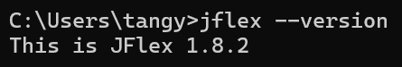
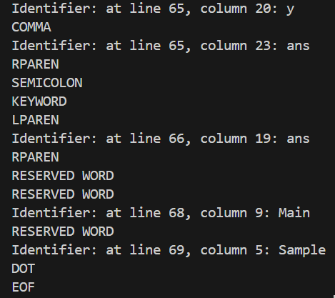
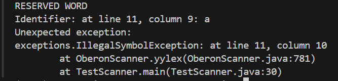
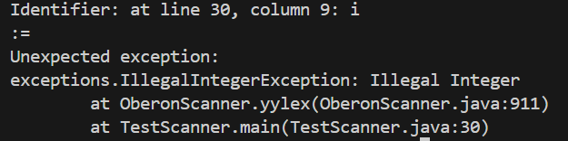
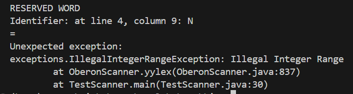
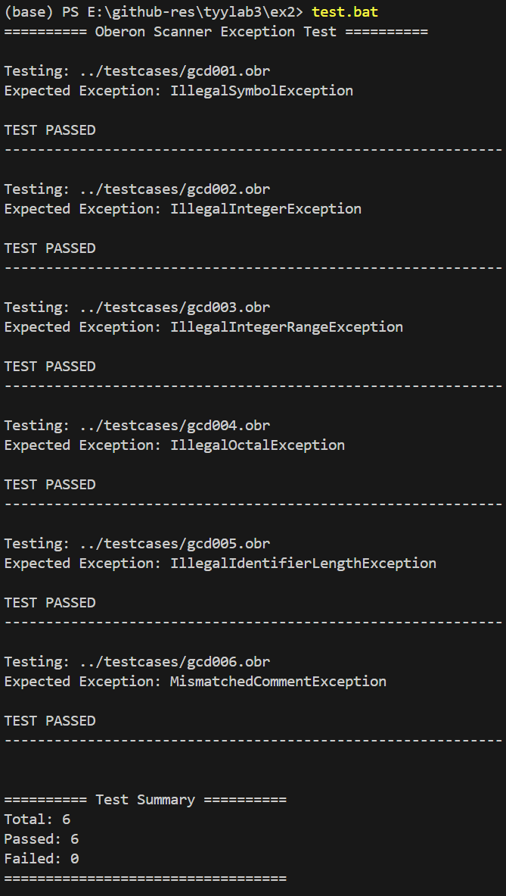

### 下载jflex

通过 `where java` 找到jdk路径

配置环境变量等



```
java -jar jflex/jflex-full-1.8.2.jar -d src/java src/jflex/oberon.flex

javac -d ..\bin -classpath ..\bin parser\*.java lexer\*.java
```

这里有个非常坑的是，`.{}` 匹配任意单个字符但除了 `\n` ，因此用 `[^]` 表示任意字符最好

%ignorecase 忽略大小写

保留字、关键字表

| 保留字                                                                                                                        | 关键字                                                      |
| ----------------------------------------------------------------------------------------------------------------------------- | ----------------------------------------------------------- |
| MODULE、PROCEDURE、BEGIN、END、<br />CONTST、TYPE、VAR、ARRAY、<br />OF、RECORD、WHILE、DO、<br />IF、THEN、ELSIF、THEN、ELSE | TYPE：INTEGER、BOOLEAN<br />PROCEDURE：read、write、writeln |

运算符表

| 符号           | 具体内容      |
| -------------- | ------------- |
| 赋值运算符     | :=            |
| 关系运算符     | = # < <= > >= |
| 一元算术运算符 | + -           |
| 二元算术运算符 | + - * DIV MOD |
| 逻辑运算       | & OR ~        |

其他

| 符号          | 具体内容               |
| ------------- | ---------------------- |
| 分割符/选择符 | ; . ( ) , [ ]         |
| 定义符        | = :                    |
| 注释          | (* *)                  |
| 标识符        | letter[digit\|letter]* |
| 整数数字      | digit+                 |

正则定义：

```
digit -> [0-9]
integer -> {digit}+
identifier -> {letter} {letter|digit}*
注释 -> "(*" ([^*] | "*"+[^*])* "*)"
```

其中整数分为八进制和十进制：

十进制整数数字：`[1-9] [0-9]*`

八进制整数数字：`0 [0-7]*`

与C++等语言不同：

没有浮点数和科学计数法，以及没有二进制表示和十六进制表示

只支持简单的非嵌套注释，java有更丰富的 `//`、`/*...*/`、`/** * */`等注释

他忽略了大小写，但是C++等语言是大小写考虑的

标识符：C/C++是可以字母下划线开头，但该语言仅支持字母开头，并且限制长度

不支持字符串

相同：

都忽略了空白字符

正常程序



异常：







测试


