```
java -jar javacup\java-cup-11b.jar -destdir src\java -parser Parser -symbols Symbol parser.cup

java -jar javacup\java-cup-11b.jar -destdir src\java -parser Parser -symbols Symbol simple.cup
```

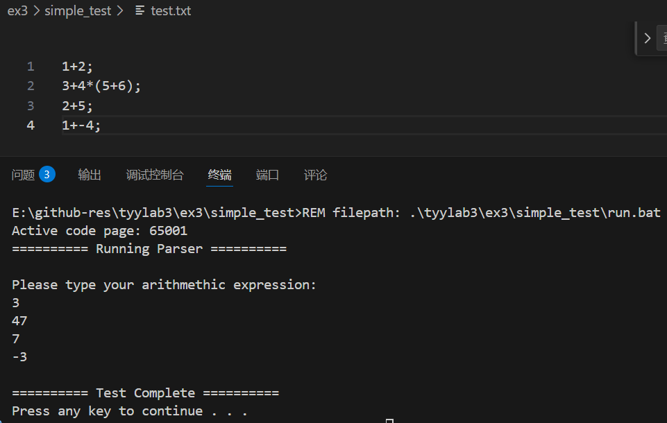

测试正确

注意由于代码比较陈旧，因此使用了 `new Integer(i_val)` 和 `DefaultSymbolFactory()` 等弃用的函数，需要修改

0.11b支持通过优先级来解决移入归约冲突

```cpp
precedence left PLUS, MINUS;
precedence left TIMES;
precedence left UMINUS;

MINUS expr:e {: RESULT = -e;          :}
  	     %prec UMINUS
```

对于-2*3，有(-2)\*3或者-(2\*3)，指定此时minus的优先级为 UMINUS

CUP 也为每个产生式分配优先级。该优先级等于该产生式中最后一个终结符的优先级。

%cup能够省去init和scan模块

如果用了 `-symbol` 需要使用

```
  <<EOF>>  { return mysym.EOF; }
```

修改

词法分析时以下终结符：

保留字（名字+左位置（行+列））、关键字表（identifier，左位置，值）

| 保留字                                                                                                                        | 关键字                                                      |
| ----------------------------------------------------------------------------------------------------------------------------- | ----------------------------------------------------------- |
| MODULE、PROCEDURE、BEGIN、END、<br />CONTST、TYPE、VAR、ARRAY、<br />OF、RECORD、WHILE、DO、<br />IF、THEN、ELSIF、THEN、ELSE | TYPE：INTEGER、BOOLEAN<br />PROCEDURE：read、write、writeln |

运算符表（名字+左位置（行+列））

| 符号           | 具体内容      |
| -------------- | ------------- |
| 赋值运算符     | :=            |
| 关系运算符     | = # < <= > >= |
| 一元算术运算符 | + -           |
| 二元算术运算符 | + - * DIV MOD |
| 逻辑运算       | & OR ~        |

其他

| 符号          | 具体内容                                               |
| ------------- | ------------------------------------------------------ |
| 分割符/选择符 | ; . ( ) , [ ]                                         |
| 定义符        | = :                                                    |
| 注释          | (* *)                                                  |
| 标识符        | letter[digit\|letter]*（identifier，左位置，string值） |
| 整数数字      | digit+（Integer，左位置，右位置，int值）               |

需要一个符号表：

```cpp
struct env{
   map<string, object> table;
   env *father;
};
对于id，他有procedure,module,var,const,type几个类别，
var又有int,bool,array
object{int type;int kind;}
```

错误恢复，使用 `error SEMI` 进行错误恢复，使用 `report_error(String message, Object info)` 进行错误报告

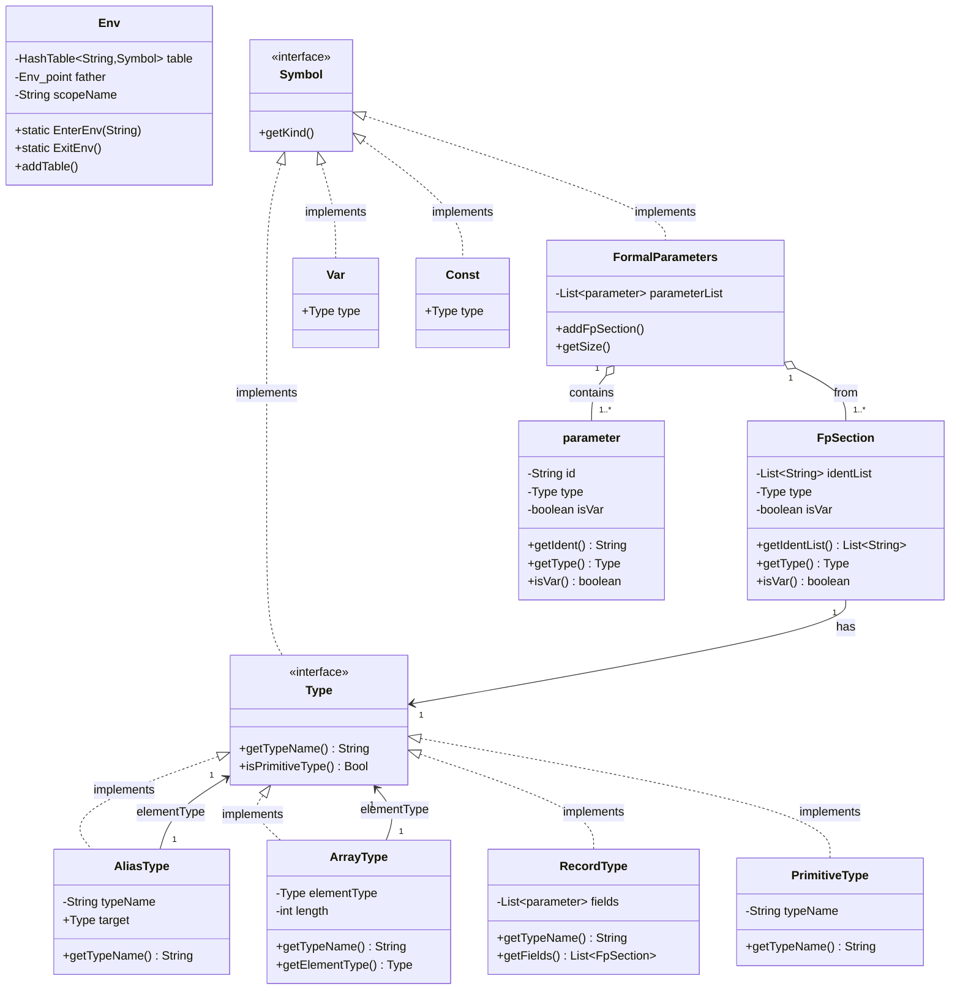

可以在产生式中间加入动作，LALR(1)会将其变为一个产生式退出空串，通过e1left来获得位置

设计时候发现有很多隐藏问题比如，这里可以看到前面没有声明的type后面不能使用（就没有循环定义了）

```cpp
typedef in_p Int_p ;
typedef int in_p;
```

生成symbol类不能是symbol，不然会和jar包里面冲突

比如一个单词不同类型能否被设置？这里简单的一个单词只能定义一次

当type是一个没定义的类型

对部分冒号缺失的判断

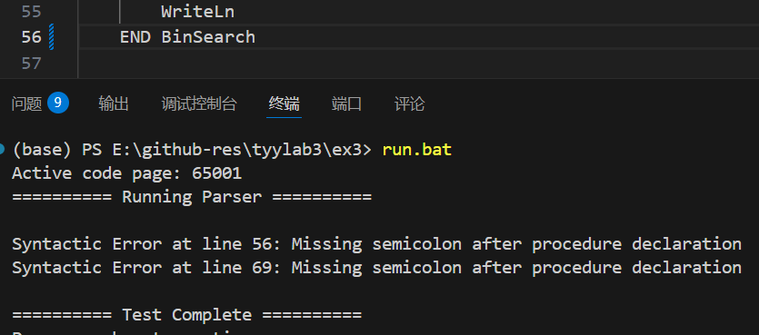

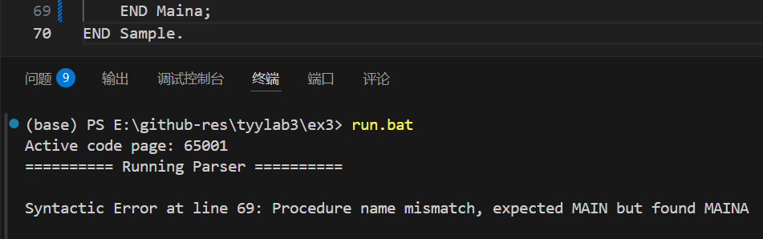

gcd008:

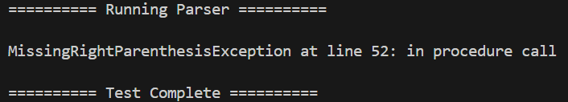

gcd014:

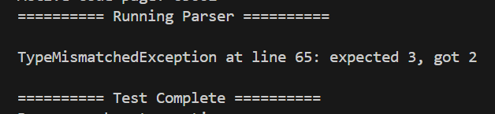

gcd013:

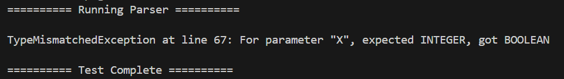

对于**actual_parameters**缺少左括号不能直接匹配 `expression RPAREN` 他会在函数调用时产生移入归约冲突：

```
Warning : *** Shift/Reduce conflict found in state #135
  between expression_list ::= expression_list COMMA expression (*)
  and     expression ::= expression (*) RPAREN
  under symbol RPAREN
  Resolved in favor of shifting.
```

这是由于此时右边有括号时可能是参数调用的状态 `func(expression)` 不一定是错误，因此这样是不行的，但我们可以使用error进行错误恢复

对于缺少右括号，匹配错误模式 `LPAREN:l expression_list_opt:el`，由于函数调用是一行的，他的右边第一个符号一定是;因此该判断是有效的

对于表达式：

只能判断缺少左括号（用error）

对于右括号：

产生归约归约冲突

```
  between expression ::= LPAREN expression RPAREN (*)
  and     expression ::= expression RPAREN (*)
  under symbols: {EQ, NEQ, LEQ, LT, GEQ, GT, PLUS, MINUS, TIMES, DIV, MOD, AND, OR, RPAREN}
  Resolved in favor of the first production.
```

`((expression)) ` 可以看到这种情况会发生冲突（LALR只看一个导致的）

**formal_parameters：**

只能判断缺少左侧括号，同样用error判断

如果判断缺少右侧括号比较麻烦，由于formal是按;来分割的，并且formal最右边也会有；，这会导致移入归约冲突（只看到一个；不知道是右边还有parameters list还是缺少右括号）

比如 `fun(a,b:INTEGER;c:INTEGER);`

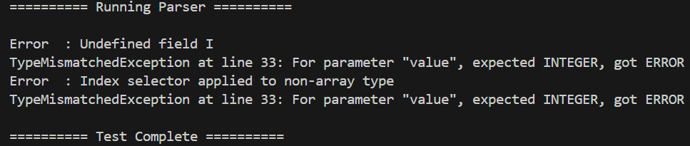

为了让一个程序识别到错误继续运行，可以返回一个error类型继续运行

为什么expression的（还是不行？

gcd010:

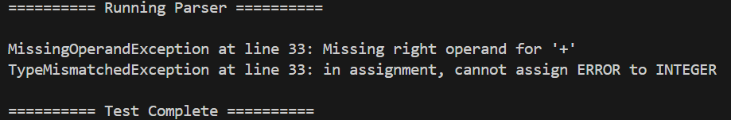

gcd018：

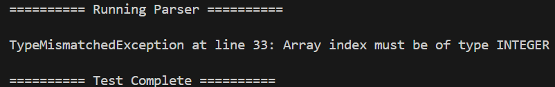

申明函数缺少右括号：`PROCEDURE BinSearch)`

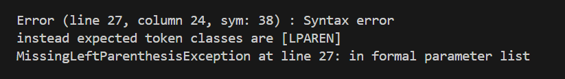

复杂的类型和调用(见 `callgraph.obr` )

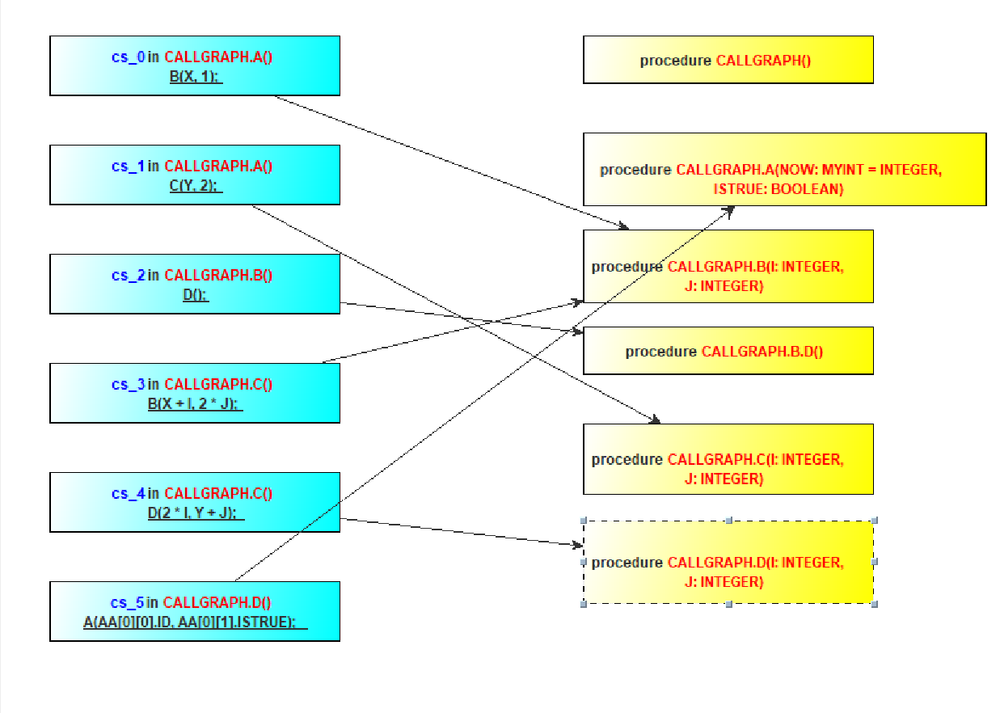


优先级分配：

对于正负号和乘号 `-1+3` 以及 `--1*2` 的优先级选取

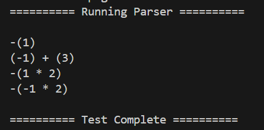
